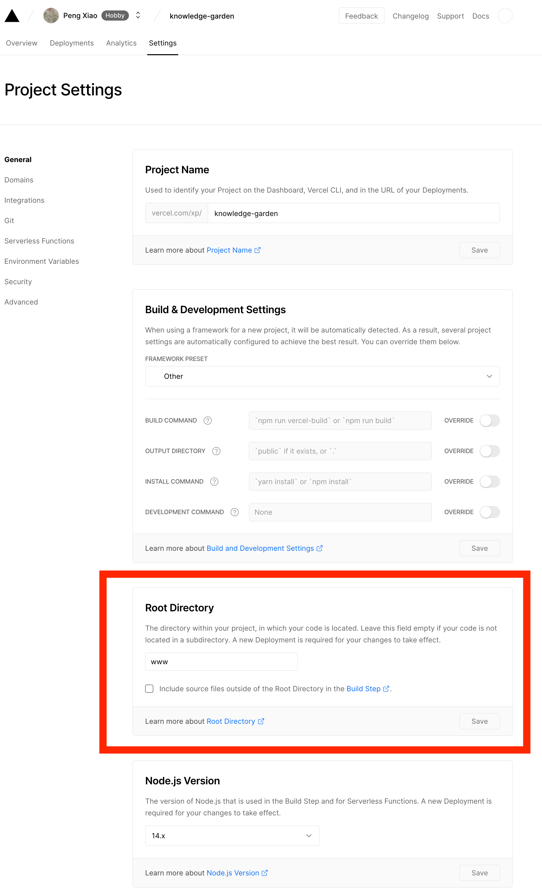

# Logseg Publish Action

Add CD to your public Logseq graph. ✨

This action will build your graph and publish it into `www` (this is configurable) folder.
You can then deploy `www` to Vercel' to achieve continuous deployment for your public graph!

## Usage

Firstly, add this step to your Github workflow. You can refer to My Example Graph's [workflows/main.yml](https://github.com/pengx17/knowledge-garden/blob/main/.github/workflows/main.yml) as an example.

```yml
steps:
- uses: pengx17/logseq-publish@0.0.3
  with:
    dest: 'www' # default to 'www'
```

Next, register a new Vercel project, configure it to use `www` as the project root.



That's it! Whenever you push changes to your Github repo, your graph will be published to Vercel.